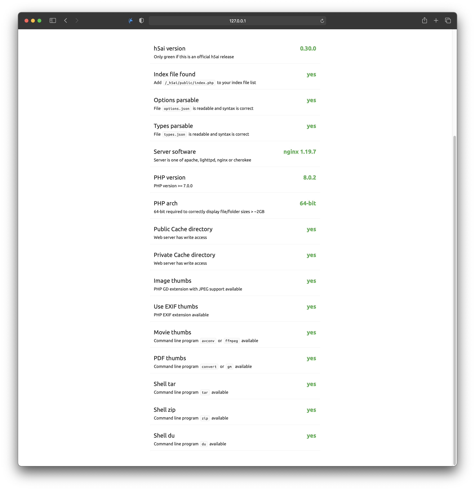
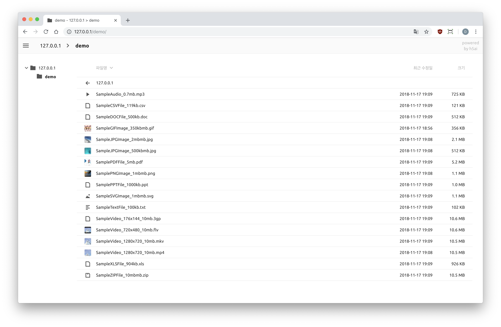

# docker-h5ai

%2C%20arm64%2C%20armv7%2C%20armv6%2C%20386-lightgrey?style=flat-square)


## What is h5ai

I'd like to quote the [official website](https://larsjung.de/h5ai/).
> h5ai is a modern file indexer for HTTP web servers with focus on your files. Directories are displayed in a appealing way and browsing them is enhanced by different views, a breadcrumb and a tree overview. Initially h5ai was an acronym for HTML5 Apache Index but now it supports other web servers too.

## What this project provided for

I hope this project would be useful for those who uses Docker for building their server.

## Features

### Core packages

I choose Alpine Linux as a base image to make it a **light-weight** service.
And I do choose Nginx-Alpine to get the benefits from some tweaks of Nginx version.

So this is composed of,

* Alpine Linux 3.13
* Nginx 1.19.7
* PHP 7.4.15

with,

* h5ai 0.30.0

And to gather all of these into one together I use supervisor that manages all of these processes.

### All functions work


h5ai supports extensional functions such as showing thumnails of audio and video, caching for better speed, etc. This image activates all of those functions.

### Supports multiple architectures

It builds from Github Actions for supporting multiple architectures such as AMD64(x86_64) and ARM64, ARMv7, ARMv6, 386.

So that you can use this on most computers supporting Docker.

## How can I use this

First of all, it assumes that you have installed Docker on your system.

### Pulling the Docker image

Pull the image from docker hub with the following command.

```bash
docker pull awesometic/h5ai
```

### Basic usage

This is how it can be a service.

Since this is the examples, these use the '--rm' option to remove the container when you terminate the interactive session.

You can run it using the following command.

```bash
docker run -it --rm \
-p 80:80 \
-v /shared/dir:/h5ai \
-v /config/dir:/config \
-e TZ=Asia/Seoul \
awesometic/h5ai
```

Basically, two directories should be mapped to the host PC.

* `/h5ai`: This will be where the shared files located.
* `/config`: This will be where stores configurations of h5ai and Nginx settings.

If you want to run this image as a daemon, use `-d` option. See the following command.

```bash
docker run -d --name=h5ai \
-p 80:80 \
-v /shared/dir:/h5ai \
-v /config/dir:/config \
-e TZ=Asia/Seoul \
awesometic/h5ai
```

If you want to login when visiting the hosted h5ai website so that implement protection from accessing anonymous users, add `HTPASSWD` environments like the below.

```bash
docker run -it --name=h5ai \
-p 80:80 \
-v /shared/dir:/h5ai \
-v /config/dir:/config \
-e TZ=Asia/Seoul \
-e HTPASSWD=true \
-e HTPASSWD_USER=awesometic \
awesometic/h5ai
```

Then only the user set by `HTPASSWD_USER`, **awesometic** can access this h5ai website with these options.

Be aware of that the `HTPASSWD` environment variable must be **true** for authentication.

And aware of this too that you have to run in interaction mode by adding **-it** to set a password for the newly created user for the first time.

Or, you can set the password for Htpasswd by passing an environment variable. In this case, you shouldn't have to use **-it** option because it is not needed at all.

```bash
docker run -d --name=h5ai \
-p 80:80 \
-v /shared/dir:/h5ai \
-v /config/dir:/config \
-e TZ=Asia/Seoul \
-e HTPASSWD=true \
-e HTPASSWD_USER=awesometic \
-e HTPASSWD_PW=awesometic \
awesometic/h5ai
```

To do the test drive, when the container runs then just let your browser browses:

``` http
http://localhost/
```


After all, you can see the directories you shared.

## Caution when update

**If the new h5ai version releases**, I overwrite all the updated files to the corresponded directories on the project folder. In this sequence, some customized files by you will be replaced into the new one.

So it is **highly recommended to make back up files of your edits** before update the Docker image.

To prevent an unexpected accident, I put minimal protection into my `init.sh` script. This checks if the current `private/conf/options.json` file is outdated from the current about to be run. If the current `options.json` is older than the newly loaded one, the script makes its backup file under the `/config` directory. See the followings.

```bash
awesometic@awesometic-nas:docker/h5ai $ ll
total 32K
-rwxr-xr-x 1 root root  12K Jul 10  2019 20190710_165345_options.json.bak
-rwxr-xr-x 1 root root  12K Feb  3 14:46 20210203_144624_options.json.bak
drwxr-xr-x 3 root root 4.0K Feb  3 14:46 h5ai
drwxr-xr-x 2 root root 4.0K Dec 14  2018 nginx
```

But since I don't know how much the users edit their h5ai files like layout or style, it won't make backups for all of the h5ai related files. So it depends on your caution.

If you have any good idea, please let me know. 😀

## TODOs

* [x] Easy access to options.json
* [x] Access permission using htpasswd
* [ ] Support HTTPS - This image doesn't support SSL even if the generated cert files are preprared. But there's another way to apply SSL if you have external Let's Encrypt program and/or a reverse proxy server.

## License

This project comes with MIT license. Please see the [license file](LICENSE).
